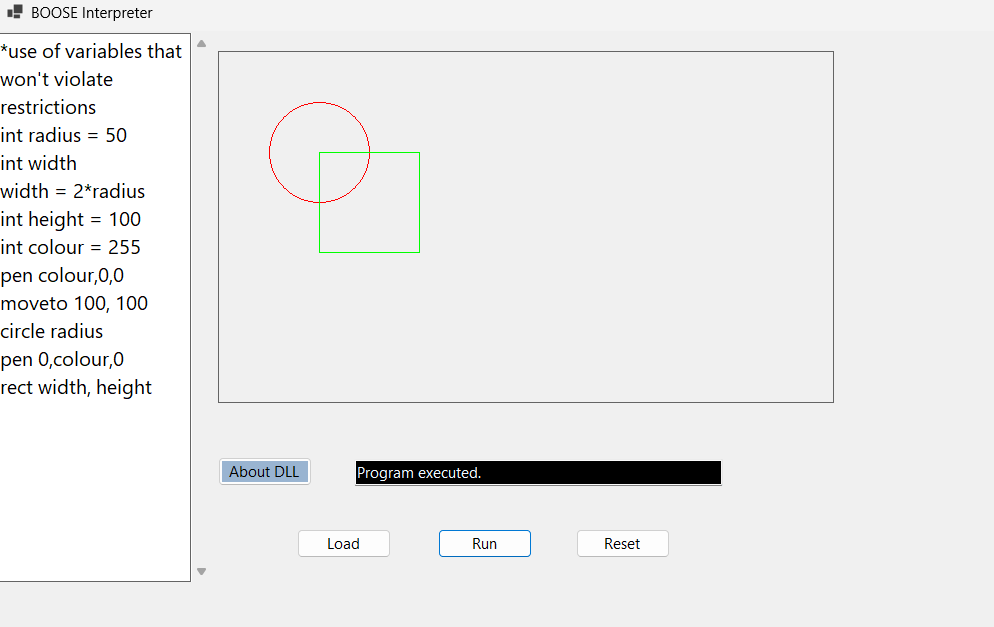

# Variables
1. Integer Variables

Integers are stored, retrieved, and used in calculations and drawing commands.

2. Real (Floating Point) Variables

Real numbers allow decimal calculations such as multiplication and circle circumference.

3. Arrays (int and real)

Arrays allow multiple values to be stored using poke and retrieved with peek.

array int nums 10
poke nums 5 = 99
peek x = nums 5

