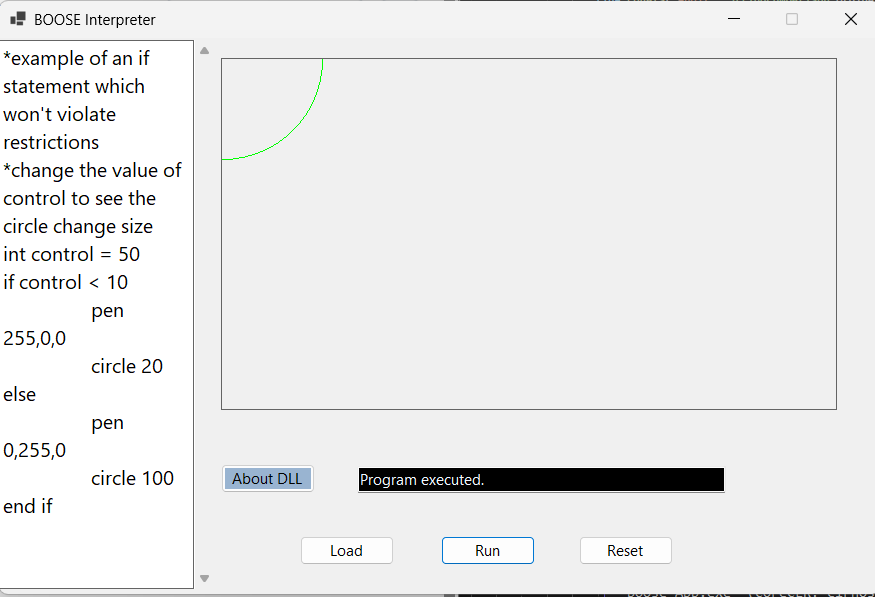
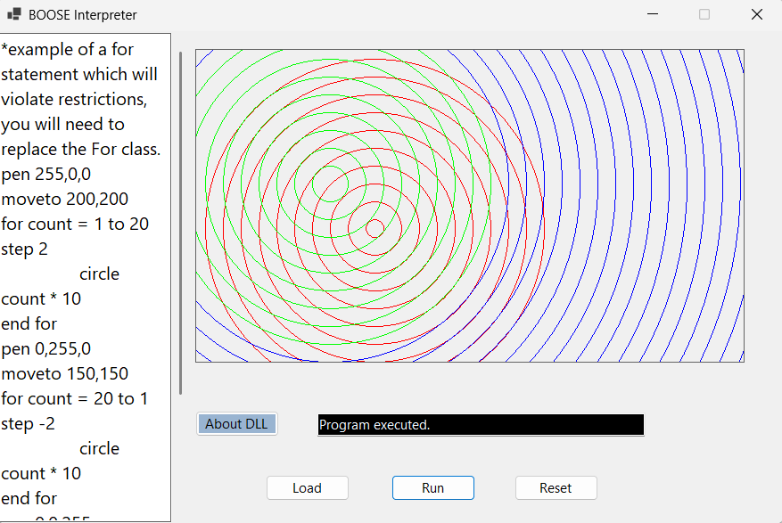

# Control Flow: IF,While, For
I replaced all the original BOOSE control flow classes.
My interpreter now understands and executes:

1. IF / ELSE

Including nested IF statements.

2. WHILE loops

Repeats while a condition is true.

3. FOR loops

Counts up or down and supports steps (like step 2 or step -2).

